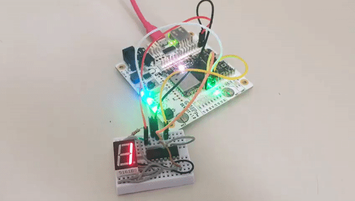

# Chip-Pro-GPIO

This is a collection of shell scripts for controlling the C.H.I.P. Pro GPIO pins.

* pins.sh converts pin numbers to sysfs numbers (from https://docs.getchip.com/chip_pro_devkit.html#gpio-sysfs-numbers)
* pinmode.sh sets the pin mode (for example `./pinmode.sh D0 OUTPUT`)
* digitalwrite.sh sets a pin to HIGH or LOW (for example `./digitalwrite.sh D0 HIGH` or `./digitalwrite.sh D1 0`)
* digitalread.sh reads the value from a pin (for example (`./digitalread.sh D0`)
* shiftout.sh can be used to attach a 595 chip register

## Example
example_shiftregister.sh contains an example to drive a 595 shift register.
In the example, it's connected to a common anode 7-segment display.

